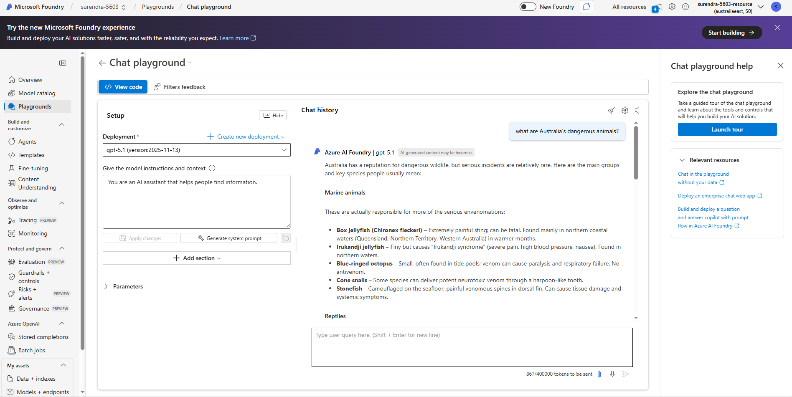

# Microsoft Foundry Assignment

This repository contains my Microsoft Foundry assignment completed as part of the AI Engineering course.

## Tasks Completed

- Created a Microsoft Foundry project
- Deployed GPT-5.1
- Tested the model in the playground
- Viewed project endpoints
- Installed Foundry Toolkit for VS Code
- Connected the project to VS Code
- Tested the model playground inside VS Code

Author:
Surendra## Screenshots

### 1. Microsoft Foundry Project

---

### 2. Model Deployment

---

### 3. Foundry Toolkit in VS Code

---

### 4. VS Code Playground

---

### 5. GitHub Repository

